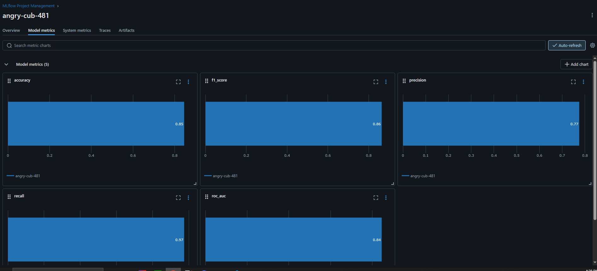

# Churn Analysis and Prediction (Group 7)
- An Huy PHAM
- David ROSSIG

## Note

This mardown file substitutes as the report of the part 2 and 3 of the graded "AI Project Methodology", to approach "AI Project Technical Methodologies" and "Explainable AI" sections. The point of this ReadMe file is to provide general knowledge about the assignement while showing what we have done as a team, most notably on predicting user retention through an e-commerce dataset.

## Summmary 

- [AI project Functional Methodologies (Case Study)](#ai-project-functional-methodologies-case-study)
- [Data](#data)
- [Code structure](#code-structure)
- [Standardization](#standardization)
- [Reproducibility](#reproducibility)
- [Documentation](#documentation)
- [Model tracking and local deployment](#model-tracking-and-local-deployment)
- [Cloud Deployement](#cloud-deployement)
- [SHAP explanation](#shap-explanation)
- [Technologies](#technologies)

## AI project Functional Methodologies (Case Study)

The case study for part 1 can be found in this repo as [PDF](docs/Part_1_exam.pdf) or [Word](docs/Part_1_exam.docx) (you can then download it on the top right)

## Data

Data can be found [here](https://www.kaggle.com/datasets/ankitverma2010/ecommerce-customer-churn-analysis-and-prediction/data), it provides 5630 entries of user behavior on an e-commerce online platform and contains these columns :
- CustomerID Unique customer ID
- Churn Churn Flag
- Tenure Tenure of customer in organization
- PreferredLoginDevice Preferred login device of customer
- CityTier City tier
- WarehouseToHome Distance in between warehouse to home of customer
- PreferredPaymentMode Preferred payment method of customer
- Gender Gender of customer
- HourSpendOnApp Number of hours spend on mobile application or website
- NumberOfDeviceRegistered Total number of deceives is registered on particular customer
- PreferedOrderCat Preferred order category of customer in last month
- SatisfactionScore Satisfactory score of customer on service
- MaritalStatus Marital status of customer
- NumberOfAddress Total number of added added on particular customer
- Complain Any complaint has been raised in last month
- OrderAmountHikeFromlastYear Percentage increases in order from last year
- CouponUsed Total number of coupon has been used in last month
- OrderCount Total number of orders has been places in last month
- DaySinceLastOrder Day Since last order by customer
- CashbackAmount Average cashback in last month

This will be our only data source for the notebook.

## Code structure

Our code is separated in 4 main parts : Notebook (Model in src) / MLFlow (ml... directories) / Sphinx (docs) / SHAP (also a notebook in src). Below is the architecture tree for a more understandble visualization, note that we didn't use any particular method of structuring : 
<pre> ```
churn_analysis
├── .gitignore
├── .idea
│   ├── .gitignore
│   └── vcs.xml
├── .readthedocs.yaml
├── docs
│   ├── build
│   │   ├── doctrees
│   │   │   ├── data.doctree
│   │   │   ├── environment.pickle
│   │   │   ├── index.doctree
│   │   │   ├── modules.doctree
│   │   │   └── notebook.doctree
│   │   └── html
│   │       ├── .buildinfo
│   │       ├── data.html
│   │       ├── genindex.html
│   │       ├── index.html
│   │       ├── modules.html
│   │       ├── notebook.html
│   │       ├── objects.inv
│   │       ├── py-modindex.html
│   │       ├── search.html
│   │       ├── searchindex.js
│   │       ├── _sources
│   │       │   ├── data.rst.txt
│   │       │   ├── index.rst.txt
│   │       │   ├── modules.rst.txt
│   │       │   └── notebook.rst.txt
│   │       └── _static
│   │           ├── alabaster.css
│   │           ├── basic.css
│   │           ├── custom.css
│   │           ├── doctools.js
│   │           ├── documentation_options.js
│   │           ├── file.png
│   │           ├── github-banner.svg
│   │           ├── language_data.js
│   │           ├── minus.png
│   │           ├── plus.png
│   │           ├── pygments.css
│   │           ├── searchtools.js
│   │           └── sphinx_highlight.js
│   ├── make.bat
│   ├── Makefile
│   ├── Part_1_exam.docx
│   ├── Part_1_exam.pdf
│   └── source
│       ├── conf.py
│       ├── data.rst
│       ├── index.rst
│       ├── modules.rst
│       ├── notebook.rst
│       ├── _static
│       └── _templates
├── mlartifacts
│   └── 502767127835434973
│       ├── e615a0353cb2450b86fa83842799a95a
│       │   └── artifacts
│       │       ├── confusion_matrix.png
│       │       └── roc_curve.png
│       └── models
│           └── m-ab86d1e357a54ad18a3dad4151ad4c0f
│               └── artifacts
│                   ├── conda.yaml
│                   ├── input_example.json
│                   ├── MLmodel
│                   ├── model.pkl
│                   ├── python_env.yaml
│                   ├── requirements.txt
│                   └── serving_input_example.json
├── mlruns
│   ├── .trash
│   ├── 0
│   │   └── meta.yaml
│   ├── 502767127835434973
│   │   ├── e615a0353cb2450b86fa83842799a95a
│   │   │   ├── artifacts
│   │   │   ├── meta.yaml
│   │   │   ├── metrics
│   │   │   │   ├── accuracy
│   │   │   │   ├── f1_score
│   │   │   │   ├── precision
│   │   │   │   ├── recall
│   │   │   │   └── roc_auc
│   │   │   ├── outputs
│   │   │   │   └── m-ab86d1e357a54ad18a3dad4151ad4c0f
│   │   │   │       └── meta.yaml
│   │   │   ├── params
│   │   │   │   ├── base_score
│   │   │   │   ├── booster
│   │   │   │   ├── callbacks
│   │   │   │   ├── colsample_bylevel
│   │   │   │   ├── colsample_bynode
│   │   │   │   ├── colsample_bytree
│   │   │   │   ├── device
│   │   │   │   ├── early_stopping_rounds
│   │   │   │   ├── enable_categorical
│   │   │   │   ├── eval_metric
│   │   │   │   ├── feature_types
│   │   │   │   ├── feature_weights
│   │   │   │   ├── gamma
│   │   │   │   ├── grow_policy
│   │   │   │   ├── importance_type
│   │   │   │   ├── interaction_constraints
│   │   │   │   ├── learning_rate
│   │   │   │   ├── max_bin
│   │   │   │   ├── max_cat_threshold
│   │   │   │   ├── max_cat_to_onehot
│   │   │   │   ├── max_delta_step
│   │   │   │   ├── max_depth
│   │   │   │   ├── max_leaves
│   │   │   │   ├── min_child_weight
│   │   │   │   ├── missing
│   │   │   │   ├── monotone_constraints
│   │   │   │   ├── multi_strategy
│   │   │   │   ├── num_parallel_tree
│   │   │   │   ├── n_estimators
│   │   │   │   ├── n_jobs
│   │   │   │   ├── objective
│   │   │   │   ├── random_state
│   │   │   │   ├── reg_alpha
│   │   │   │   ├── reg_lambda
│   │   │   │   ├── sampling_method
│   │   │   │   ├── scale_pos_weight
│   │   │   │   ├── subsample
│   │   │   │   ├── tree_method
│   │   │   │   ├── validate_parameters
│   │   │   │   └── verbosity
│   │   │   └── tags
│   │   │       ├── author
│   │   │       ├── mlflow.runName
│   │   │       ├── mlflow.source.name
│   │   │       ├── mlflow.source.type
│   │   │       ├── mlflow.user
│   │   │       ├── model_type
│   │   │       └── purpose
│   │   ├── meta.yaml
│   │   └── models
│   │       └── m-ab86d1e357a54ad18a3dad4151ad4c0f
│   │           ├── meta.yaml
│   │           ├── metrics
│   │           │   ├── accuracy
│   │           │   ├── f1_score
│   │           │   ├── precision
│   │           │   ├── recall
│   │           │   └── roc_auc
│   │           ├── params
│   │           │   ├── base_score
│   │           │   ├── booster
│   │           │   ├── callbacks
│   │           │   ├── colsample_bylevel
│   │           │   ├── colsample_bynode
│   │           │   ├── colsample_bytree
│   │           │   ├── device
│   │           │   ├── early_stopping_rounds
│   │           │   ├── enable_categorical
│   │           │   ├── eval_metric
│   │           │   ├── feature_types
│   │           │   ├── feature_weights
│   │           │   ├── gamma
│   │           │   ├── grow_policy
│   │           │   ├── importance_type
│   │           │   ├── interaction_constraints
│   │           │   ├── learning_rate
│   │           │   ├── max_bin
│   │           │   ├── max_cat_threshold
│   │           │   ├── max_cat_to_onehot
│   │           │   ├── max_delta_step
│   │           │   ├── max_depth
│   │           │   ├── max_leaves
│   │           │   ├── min_child_weight
│   │           │   ├── missing
│   │           │   ├── monotone_constraints
│   │           │   ├── multi_strategy
│   │           │   ├── num_parallel_tree
│   │           │   ├── n_estimators
│   │           │   ├── n_jobs
│   │           │   ├── objective
│   │           │   ├── random_state
│   │           │   ├── reg_alpha
│   │           │   ├── reg_lambda
│   │           │   ├── sampling_method
│   │           │   ├── scale_pos_weight
│   │           │   ├── subsample
│   │           │   ├── tree_method
│   │           │   ├── validate_parameters
│   │           │   └── verbosity
│   │           └── tags
│   │               ├── mlflow.modelVersions
│   │               ├── mlflow.source.name
│   │               ├── mlflow.source.type
│   │               └── mlflow.user
│   └── models
│       └── Churn-XGBClassifier
│           ├── meta.yaml
│           └── version-1
│               └── meta.yaml
├── poetry.lock
├── pyproject.toml
├── README.md
├── src
│   ├── confusion_matrix.png
│   ├── data
│   │   └── ecommerce.csv
│   ├── E Commerce Dataset.xlsx
│   ├── mlruns
│   │   └── 0
│   │       └── meta.yaml
│   ├── notebook.ipynb
│   ├── notebook.py
│   ├── project_structure.txt
│   ├── roc_curve.png
│   ├── xai.ipynb
│   ├── __init__.py
│   └── __pycache__
│       ├── churn_notebook.cpython-311.pyc
│       └── notebook.cpython-311.pyc
└── tests
    └── __init__.py
``` </pre>

## Standardization

As seen below, we respect hte PEP8 style :


## Reproducibility 

Packages are shared via poetry (poetry lock and pytoml files)

## Documentation

Documentation was generated using Sphinx, you can check it [here](https://churn-analysis.readthedocs.io/en/latest/).

## Model tracking and local deployment

We used MLFlow to deploy the model locally. Once you have cloned this project, you can run "mlflow server --host 127.0.0.1 --port 8080" to launch the server and observe the expirement run.

Some screenshots : 




## Cloud Deployement

As we were short in time, we decided to not deloy our work through Cloud, however if we did, we would have :
- Set up Google Cloud
- Create a storage bucket with code and files
- Build a Docker container of the whole project
- Push it into Google Cloud and run it from there

## SHAP explanation

Through the [SHAP notebook](./src/xai.ipynb), we explain a single prediction by showing how each feature pushed the model output from the baseline (expected value) to the final prediction and also the SHAP values, also showing the importance of each feature

## Technologies

This project leverages several key Python libraries for data analysis, machine learning, visualization, and model management:

- **pandas**: Data manipulation and analysis
- **numpy**: Numerical computations and array operations
- **scikit-learn**: Machine learning algorithms and preprocessing
- **matplotlib**: Data visualization
- **seaborn**: Statistical data visualization (built on matplotlib)
- **xgboost**: Gradient boosting models for classification/regression
- **openpyxl**: Excel file I/O (reading `.xlsx` datasets)
- **mlxtend**: Utilities and tools for machine learning workflows
- **imbalanced-learn**: Techniques for handling imbalanced datasets
- **mlflow**: Machine learning lifecycle management and experiment tracking
- **ipykernel**: Jupyter Notebook kernel support
- **sphinx**: Automatic generation of code documentation
- **SHAP**: explain the predictions of machine learning models

**THIS NOTEBOOK IS FOR PEDAGOCIAL PURPOSES ONLY, UNDER THE GUIDANCE OF THE TEACHER AND EPTIA**